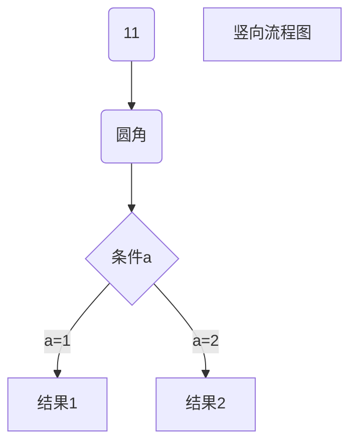

# @symph/joy

官网：[https://lnlfps.github.io/symph-joy](https://lnlfps.github.io/symph-joy)

<<<<<<< HEAD
@symph/joy 让我们轻松的进行前端应用开发，零配置可用，简单清晰的业务和数据管理模块，已集成大量最佳实践的优化方案，即使你才刚接触 React，也可以轻松创建高可用、可维护的前端应用。

> 该项目已在生产环境大量使用，如有任何疑问、使用帮助、bug 反馈、特性讨论，请和我们联系(邮件：lnlfps@gmail.com; QQ 群：929743297)，或者到 github 创建 issue，欢迎加入。

## 特征

- 零配置可用，优化的默认配置，快速开发，已集成 react、redux、react-router4 和 ES6、7 语法支持等
=======
@symph/joy 是 symph 架构体系中的应用层架构，集成了大量最佳实践的方案和研发工具，零配置可用，即使你才刚接触 React 或 Node 服务研发，也可以轻松快速的创建高可用的 JS/TS 应用。

> @symph/joy 集成了 @symph/react 和 @symph/server 前后端框架

## 特征

- 零配置可用，优化的默认配置，快速启动开发。
>>>>>>> abc63a5cb558040866ccd2a75c4d55bc1707f26b
- 支持服务端渲染，在业务组件内部获取渲染数据，组件内聚更高，便于维护
- MVC 架构，模块化设计，简化 redux 的学习和使用
- 依赖自动注入，专注组件内部实现，依赖关系更明确，方便调用
- 支持`@`装饰器将普通 Class 申明为 Controller 或 Model 等，不侵入业务代码
- 支持 react hook 模式开发函数式组件，轻松链接 Model 管理业务流程
- 全局支持 async 语法，复杂的业务逻辑也能轻松找到解决方案
- 支持静态版本导出，脱离 Node.js 运行，也可单独导出静态页面
- 内置网络请求代理服务，解决跨域和服务中转问题，前后端分离开发畅通无阻
- 支持插件化配置，便于功能扩展

<<<<<<< HEAD

## 联系我们

Github Issue:  https://github.com/symph-joy/symph-joy/issues   
邮件：lnlfps@gmail.com   
=======
## 联系我们

Github Issue: https://github.com/symph-joy/symph-joy/issues  
邮件：lnlfps@gmail.com  
>>>>>>> abc63a5cb558040866ccd2a75c4d55bc1707f26b
QQ 群：929743297
