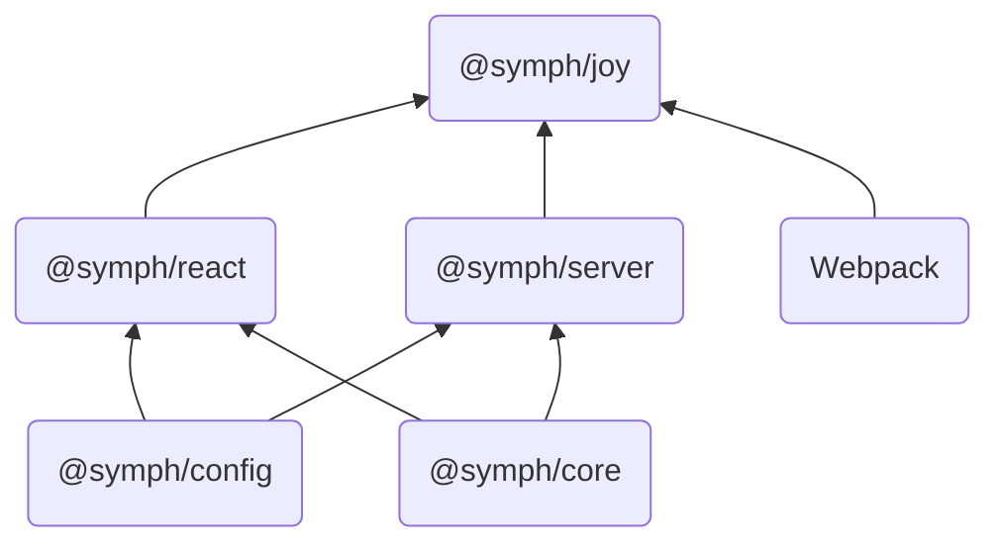

# @symph/joy

@symph/joy 是 symph 架构体系中的应用层架构，集成了大量最佳实践的方案和研发工具，零配置可用，即使刚接触 React 或 Node 服务研发，也可以轻松快速的创建可靠的 JS/TS 应用。

`@symph/core` IoC 核心，提供组件容器、注入器、全局 Hook 管理的能力。

[`@symph/config`](/config/start/introduce) 应用配置管理，提供应用级的配置读取、验证、注入等。

[`@symph/react`](/react/start/introduce) React 的 MVC 框架，可轻松开发大型复杂 React 单页面应用，提供 React MVC 基础组件，统一数据管理，单向数据绑定和路由等基础功能。

[`@symph/server`](/react/start/introduce) 基于依赖注入和装饰器，类似 Spring MVC 的 Web 后端研发框架。

[`@symph/joy`](/joy/start/introduce) 整合 @symph/server 和 @symph/react，server 提供业务服务，react 负责展示和交互，是集成开发调试、编译打包、服务运行等的全栈式工具。

## 特征

- 零配置可用，集成最佳实践配置，快速启动开发，提供研发全流程工具链。
- 支持多端多类型应用开发：React、Electron、Server、Proxy Server 等。
- 现代化面向对象和 IoC 设计原则，更能适应企业级迭代开发。
- 默认支持和推荐使用 TypeScript，提供静态类型检查和高级语法特性。
- Joy React 应用原生支持：全局状态管理、约定路由、懒加载、热更新、服务端渲染、预渲染、静态部署等。
- Joy Node 应用原生支持：全局配置管理、MVC 组件、Middleware、Pipe、Guards、Fastify 集成等。
- 子模块独立维护和使用，即可选择性单独使用 IoC 库，Config 配置管理、React 应用、Node 应用。
- 插件化开发，便于定制功能和扩展能力。

## 联系我们

有任何疑问请联系我们！

Github Issue: https://github.com/symph-joy/symph-joy/issues  
邮件：lnlfps@gmail.com  
QQ 群：929743297
